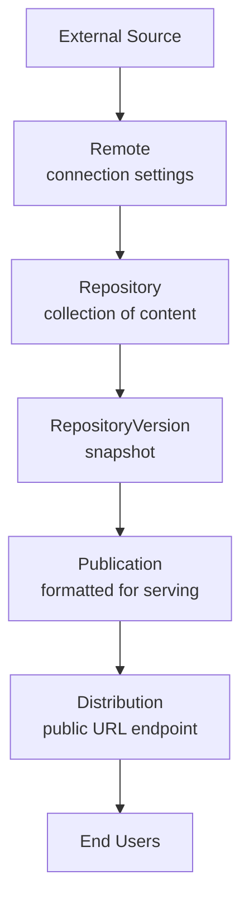

# Pulp Basic Terminology

## What is Pulp?

Pulp is a platform for managing software packages and other content. It helps you fetch, store, organize, and distribute content like RPM packages, Python packages, container images, and more.

Think of Pulp as a content warehouse with version control, where you can:
- Download content from external sources
- Organize it into collections
- Take snapshots of those collections
- Serve the content to users

## Core Concepts

### Content

**What it is:** A piece of managed content - the basic unit that Pulp works with.

**Examples:** An RPM package, a Python wheel, a container image, or a file.

**Key points:**
- Each piece of content can have one or more files (called Artifacts) associated with it
- The same content can exist in multiple repositories (Pulp doesn't duplicate it)
- Content is immutable - once created, it doesn't change

### Artifact

**What it is:** The actual physical file stored on disk.

**Examples:** A .rpm file, a .tar.gz archive, or a .jpg image.

**Key points:**
- Identified by its SHA256 checksum
- Multiple content units can share the same artifact (saves disk space)
- Artifacts are immutable and deduplicated

**Relationship:** Content is like the metadata (name, version, description), while Artifact is the actual file. One content unit can have multiple artifacts (like source code + documentation), and the same artifact can be part of multiple content units.

### Repository

**What it is:** A collection of content units, like a folder or library.

**Examples:** A repository of RPM packages for RHEL 9, or a collection of Python packages.

**Key points:**
- Can only contain one type of content (e.g., only RPMs or only Python packages)
- You can add, remove, or modify content in a repository
- Each time you make changes, Pulp creates a new snapshot (RepositoryVersion)

### RepositoryVersion

**What it is:** A snapshot of a repository at a specific point in time.

**Think of it like:** Git commits - each version captures the exact state of the repository.

**Key points:**
- Immutable - once created, it never changes
- Numbered sequentially (version 1, 2, 3, etc.)
- Allows you to rollback or promote specific versions
- Used as the basis for publishing and distribution

**Relationship to Repository:** A Repository is a container that evolves over time, while a RepositoryVersion is a frozen snapshot. Every time you sync new content or make changes to a Repository, a new RepositoryVersion is created.

### Remote

**What it is:** A connection to an external source of content.

**Examples:** A URL pointing to a Fedora mirror, PyPI, or Docker Hub.

**Key points:**
- Stores connection details (URL, credentials, proxy settings)
- Defines how to download content (immediately, on-demand, or stream)
- Used to sync content from external sources into your repositories

**Download policies:**
- **Immediate:** Download everything right away
- **On-demand:** Download metadata now, download files only when someone requests them
- **Streamed:** Don't save files at all, just stream them when requested

### Publication

**What it is:** The result of preparing a RepositoryVersion for distribution.

**Think of it like:** Packaging a repository snapshot for delivery, with all necessary metadata files.

**Key points:**
- Created from a RepositoryVersion
- Contains metadata and references to all the content
- Different plugins generate different types of publications (RPM metadata, PyPI index, etc.)

**Relationship to RepositoryVersion:** A RepositoryVersion is the raw snapshot of content, while a Publication is that snapshot formatted and ready to be served to clients. You might create multiple Publications from the same RepositoryVersion.

### Distribution

**What it is:** A URL endpoint that serves content to clients.

**Think of it like:** The public-facing address where users can access your content.

**Key points:**
- Has a `base_path` that determines the URL (e.g., `/pulp/content/my-repo/`)
- Can serve a Publication or directly serve a RepositoryVersion
- Can have access controls (ContentGuard) to restrict who can access it

**Relationship to Publication and Repository:** A Distribution is the delivery mechanism. It takes a Publication (or RepositoryVersion) and makes it available at a specific URL so clients can download content.

## How Everything Connects

Here's the typical workflow and how these concepts work together:

### 1. Syncing Content (Importing)

1. You create a **Remote** pointing to an external source
2. You create a **Repository** to store the content
3. You sync the Remote into the Repository
4. Pulp downloads the **Content** and **Artifacts**
5. A new **RepositoryVersion** is created with the synced content

### 2. Publishing and Distributing (Exporting)

1. You select a **RepositoryVersion** (a specific snapshot of your repository)
2. You create a **Publication** from that version (generates metadata files)
3. You create or update a **Distribution** to serve the Publication
4. Users can now access the content at the Distribution's URL

### 3. The Complete Flow

## Key Relationships Simplified

- **Repository contains Content:** A repository is a collection of content units
- **Content has Artifacts:** Content is the metadata, artifacts are the actual files
- **Repository creates RepositoryVersions:** Every change makes a new snapshot
- **Remote fills Repository:** External sources sync content into repositories
- **Publication packages RepositoryVersion:** Prepares a snapshot for distribution
- **Distribution serves Publication:** Makes the content available at a URL

## Example Scenario

Let's say you want to mirror the Fedora RPM repository:

1. **Create a Remote** pointing to `https://dl.fedoraproject.org/pub/fedora/...`
2. **Create a Repository** named "fedora-39"
3. **Sync** the Remote into the Repository
   - Pulp downloads all the RPM packages (Artifacts)
   - Creates Content units for each package
   - Creates RepositoryVersion 1 with all the content
4. **Create a Publication** from RepositoryVersion 1
   - Generates RPM repository metadata (repodata)
5. **Create a Distribution** with base_path "fedora/39" pointing to the Publication
6. **Clients** can now run `dnf install` using `http://your-pulp-server/pulp/content/fedora/39/`

Later, when Fedora releases updates:

7. **Sync again** - creates RepositoryVersion 2 with the new packages
8. **Create new Publication** from RepositoryVersion 2
9. **Update the Distribution** to point to the new Publication
10. **Clients** automatically get the updates

If something breaks, you can easily **rollback** by pointing the Distribution back to the Publication from RepositoryVersion 1.

## Summary

Pulp's architecture separates concerns:

- **Content/Artifacts:** What you're managing (the data)
- **Repository/RepositoryVersion:** How you organize it (collections and snapshots)
- **Remote:** Where you get it from (external sources)
- **Publication:** How you prepare it (formatting for delivery)
- **Distribution:** Where users access it (the public endpoint)

This separation allows for powerful features like versioning, rollback, content promotion across environments (dev → test → prod), and efficient storage through deduplication.
