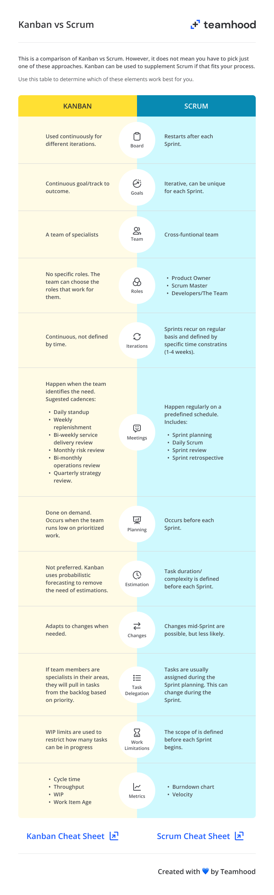
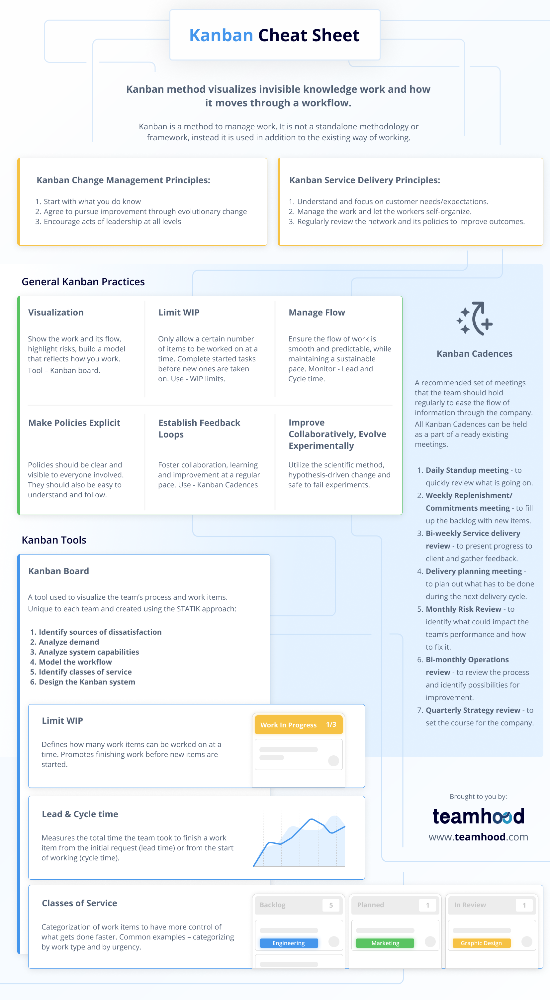

# Agile & Kanban

Here's a quick comparison of Scrum, Kanban, and Scrumban:

| Aspect              | Scrum                                      | Kanban                                      | Scrumban                                    |
|---------------------|--------------------------------------------|---------------------------------------------|---------------------------------------------|
| **Framework**       | Structured Agile framework                 | Visual workflow management method           | Hybrid approach combining Scrum and Kanban  |
| **Roles**           | Defined roles (Scrum Master, Product Owner, Development Team) | No prescribed roles                         | Combines roles from both Scrum and Kanban  |
| **Iterations**      | Time-boxed Sprints (2-4 weeks)             | Continuous flow of work                     | Uses Sprints but allows continuous flow for some tasks |
| **Board**           | Scrum board with columns for the Sprint Backlog, In Progress, Done | Kanban board with columns representing stages | Kanban board with elements of Scrum board  |
| **WIP Limits**      | Implicit WIP limits through Sprint planning and commitment | Explicit WIP limits for each stage          | Uses WIP limits from Kanban within the context of Sprints |
| **Planning**        | Sprint Planning at the beginning of each Sprint | Continuous planning and prioritization       | Sprint Planning with flexibility to adjust in between |
| **Meetings**        | Prescribed ceremonies (Sprint Planning, Daily Stand-ups, Sprint Review, Sprint Retrospective) | Optional, but regular reviews recommended    | Key Scrum ceremonies with Kanban-style continuous review |
| **Measurement**     | Focus on velocity, burn-down charts        | Focus on flow metrics (cycle time, lead time) | Tracks both velocity and flow metrics       |
| **Flexibility**     | Changes typically made at the end of each Sprint | Highly flexible, adaptable to changes anytime | More flexible than Scrum, less rigid than Kanban |
| **Focus**           | Delivering potentially shippable increments each Sprint | Ensuring a smooth flow of work               | Combining flow efficiency with incremental delivery |
| **Improvement**     | Sprint Retrospective for continuous improvement | Continuous improvement through regular reviews and data analysis | Regular retrospectives with continuous process adjustments |
| **Task Handling**   | Tasks and user stories are planned per Sprint | Tasks are continuously pulled based on priority | Tasks are planned per Sprint, but with flexibility to pull in additional work |

### Comparison Summary

- **Scrum:**
    - **Structured**: Defined roles, ceremonies, and artifacts.
    - **Time-boxed**: Work is planned in fixed-length Sprints.
    - **Predictable**: Focuses on delivering a potentially shippable product increment every Sprint.

- **Kanban:**
    - **Flexible**: No fixed roles or time-boxed iterations.
    - **Flow-focused**: Emphasizes continuous delivery and managing flow.
    - **Adaptable**: Easily adjusts to changes at any time.

- **Scrumban:**
    - **Hybrid Approach**: Combines the structure of Scrum with the flexibility of Kanban.
    - **Balanced Planning**: Uses Sprints but allows for continuous task adjustments.
    - **Enhanced Flexibility**: Retains key Scrum ceremonies while incorporating Kanban principles like WIP limits and continuous improvement.

---

## Framework Complexity

---

## Kanban vs Scrum

---

## Kanban Cheat Sheet

---

## Other Helpful Links

- [Scrumban vs Kanban](https://whiteboards.io/blog/scrumban-vs-kanban/)
- [The 12 Principles behind the Agile Manifesto](https://www.agilealliance.org/agile101/12-principles-behind-the-agile-manifesto/)
- [The Source Training](https://source.redhat.com/communities/communities_of_practice/cross_cutting_co/agile_devops_cop/trainingdelivery/trainingofferigns)
- [Agile Manifesto](https://agilemanifesto.org/iso/en/manifesto.html)
- [Scrum Guide](https://www.scrum.org/resources/scrum-guide)
- [Unified Backlog Adoption](https://source.redhat.com/groups/public/agile_transformation_and_continuous_improvement/wiki/unified_backlog_adoption)
- [Roles and Responsibilities](https://source.redhat.com/groups/public/agile_transformation_and_continuous_improvement/wiki/continuous_improvement_responsibilities__roles_at_a_team_level)
- [Training and Enablement](https://source.redhat.com/groups/public/agile_transformation_and_continuous_improvement/wiki/continuous_improvement_training__enablement)
- [Agile Transformation Terminology](https://docs.google.com/document/d/1N5Zmz6oQjYUBFVNr8BFUNycg7dDj-tU-ZGqh0FSUoNI/edit#heading=h.8rv2lohwixhf)
- [Agile & DevOps Community of Practice](https://source.redhat.com/communities/communities_of_practice/cross_cutting_co/agile_devops_cop)

