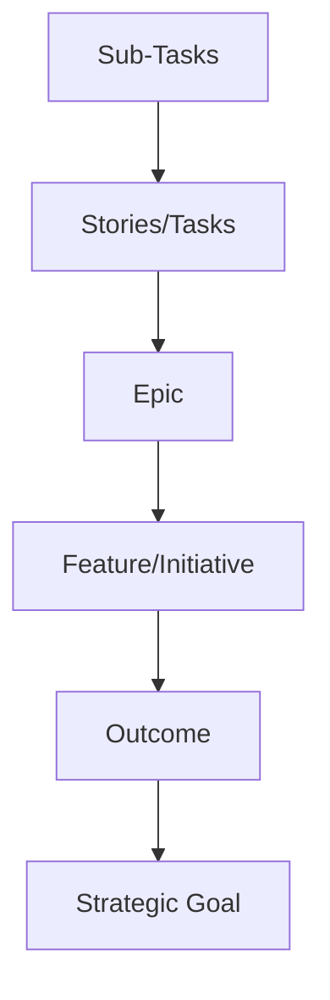
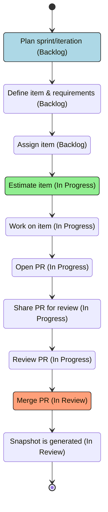
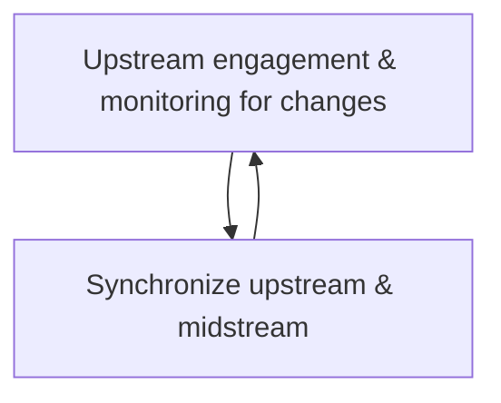
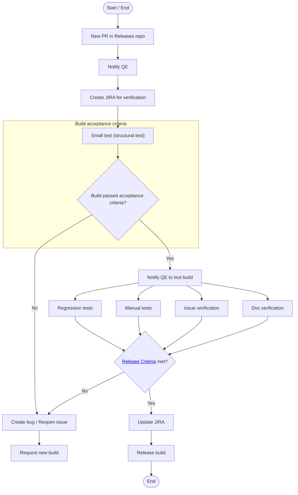
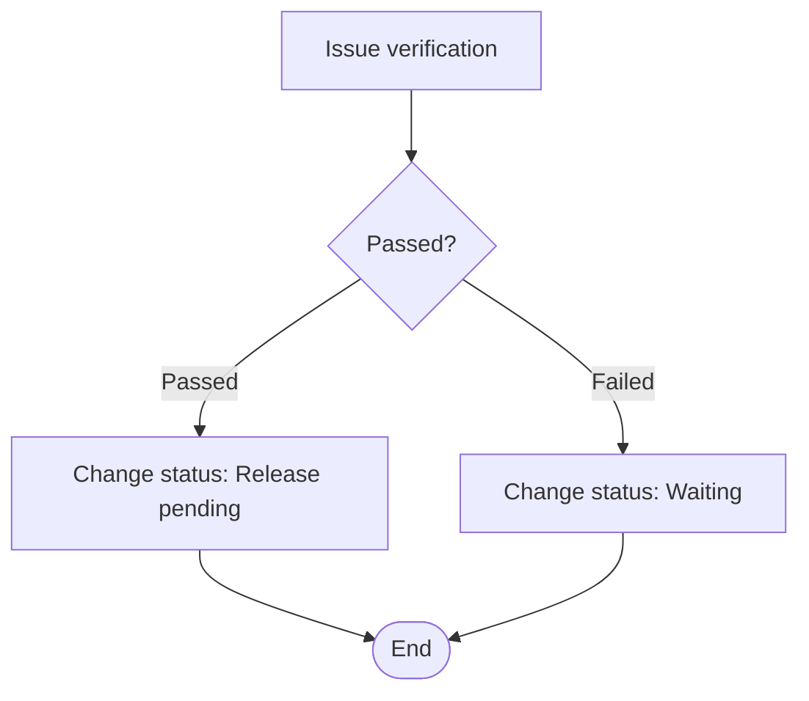

---
config:
  look: handDrawn
---

# Team Workflows

Use this guide to familiarize yourself with our typical workflows and how we track our work.

## Jira statuses

The [Red Hat Standards for Jira](https://spaces.redhat.com/pages/viewpage.action?spaceKey=JiraAid&title=Red+Hat+Standards%3A+Issue+Types) includes a set of issue types and issue type schemes that are available to all projects in Red Hat Jira.

The issue types form a hierarchy; there are 6 levels to it. Using the parent-child relationship, issues can be linked to one another, which allows us to connect work items to bigger efforts or goals. The top 3 levels are for strategic issues or strategic projects, and the bottom 3 levels are for execution (team) projects. Issue type schemes determine what issue types are available in a project–the scheme packages multiple issue types together.

### Strategic Goal

**Strategic Goals** are the highest level issue type in Jira. Within Product Engineering, they only exist in the `HATSTRAT` project, lending to them being colloquially called "Hat-strats."

### Outcome

**Outcomes** are where Product Management steps in. This level is where objectives should be focused on a measurable outcome.

### Feature/Initiative

A **Feature** is a large product/portfolio goal or focus area that has clear start and completion criteria. It may capture multiple deliverables broken down as epics spanning multiple teams and potentially multiple releases.

An **Initiative** is a capability or a well-defined set of functionality that delivers business value.

### Epic

An **Epic** is a big user story that needs to be broken down further. They group together bugs, stories, and tasks to show the progress of a larger effort. In agile development, epics usually represent a significant deliverable, such as a new capability or experience in the software your team develops. Epics are goal based and should be scoped to a single release.

### Stories/Tasks

A **Story** is the smallest unit of work that needs to be done and is end user facing.

A **Task** is a unit of work that needs to be accomplished, but isn't user facing.

### Sub-Tasks

A **Sub-Task** is a piece of work required to complete a Task. They're often used to break down tasks.

---

## Development workflow

This is a visual representation of what a typical development workflow looks for us and how the Jira status changes as we progress through it (color change indicates a status change in Jira):

:::info
Note that the JIRA status does not change when your PR is being reviewed, only once it has been merged and is ready for QE.
:::

Continuous throughout the workflow:

Issues can arise (bugs, security) in our workflows that affect upstream. If that happens, be sure to share with the team as soon as possible.

---

## Quality workflows

### New build

Once a pull request is merged and the Jira status is updated, the QE process for testing a new build begins.

#### Release Criteria

- **Bugs** - Blocker, Critical all resolved (<a href="https://issues.redhat.com/issues/?filter=12429670&jql=project%20in%20(%22Trusted%20Artifact%20Signer%22)%20and%20issuetype%20%3D%20Feature%20and%20fixVersion%20%3D%201.1.0%20and%20status%20%3D%20%22Release%20Pending%22%20order%20by%20priority" target="_blank">Release Pending</a>)
- **Customer Cases** - all resolved (Release Pending)
- **Regressions not Done** - all resolved
- **DOC Issues in Content Plan** - all resolved (Release Pending)

### Issue verification

- **Issue Outcome**: Ensure the implementation meets the initial request and addresses the issue fully. Functionality: Verify that the feature works as expected and hasn’t been broken by other changes.
- **Documentation**: Confirm that all necessary documentation is provided.
- **Test Coverage**: Check that appropriate tests have been added.
- **Release Notes**: Review the release notes for clarity and completeness.

[Here is an example](https://issues.redhat.com/browse/SECURESIGN-1318) of a Jira verification issue.

 

:::tip
It's important that the review is conducted by someone other than the person who resolved the issue. Ideally, the review should be performed by the original reporter if possible.
:::

## Release workflows

The release workflow will differ based on the target (e.g. OpenShift, RHEL). For information about how to do a release, and to see an overview of the process, go [here](/technical-guides/release-coordination#process-overview).

## Links

- [Red Hat JIRA Issue Types](https://docs.engineering.redhat.com/pages/viewpage.action?spaceKey=JiraAid&title=Red+Hat+Standards%3A+Issue+Types)
- [Original Miro board](https://miro.com/app/board/uXjVKqZnfzM=/)
