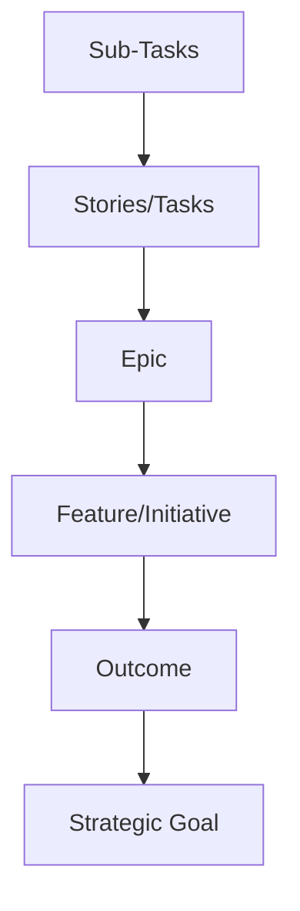

---
config:
  look: handDrawn
---

# Team Workflows

Every team uses their own Jira workflows, which we need to abide by when possible, however, Red Hat enforces certain standards in Jira.

## Jira statuses

The [Red Hat Standards for Jira](https://spaces.redhat.com/pages/viewpage.action?spaceKey=JiraAid&title=Red+Hat+Standards%3A+Issue+Types) includes a set of issue types and issue type schemes that are available to all projects in Red Hat Jira.

The issue types form a hierarchy; there are 6 levels to it. Using the parent-child relationship, issues can be linked to one another, which allows us to connect work items to bigger efforts or goals. The top 3 levels are for strategic issues or strategic projects, and the bottom 3 levels are for execution (team) projects. Issue type schemes determine what issue types are available in a project–the scheme packages multiple issue types together.

### Strategic Goal

**Strategic Goals** are the highest level issue type in Jira. Within Product Engineering, they only exist in the `HATSTRAT` project, lending to them being colloquially called "Hat-strats."

### Outcome

**Outcomes** are where Product Management steps in. This level is where objectives should be focused on a measurable outcome.

### Feature/Initiative

A **Feature** is a large product/portfolio goal or focus area that has clear start and completion criteria. It may capture multiple deliverables broken down as epics spanning multiple teams and potentially multiple releases.

An **Initiative** is a capability or a well-defined set of functionality that delivers business value.

### Epic

An **Epic** is a big user story that needs to be broken down further. They group together bugs, stories, and tasks to show the progress of a larger effort. In agile development, epics usually represent a significant deliverable, such as a new capability or experience in the software your team develops. Epics are goal based and should be scoped to a single release.

### Stories/Tasks

A **Story** is the smallest unit of work that needs to be done and is end user facing.

A **Task** is a unit of work that needs to be accomplished, but isn't user facing.

### Sub-Tasks

A **Sub-Task** is a piece of work required to complete a Task. They're often used to break down tasks.

---

## Links

- [Red Hat JIRA Issue Types](https://docs.engineering.redhat.com/pages/viewpage.action?spaceKey=JiraAid&title=Red+Hat+Standards%3A+Issue+Types)

